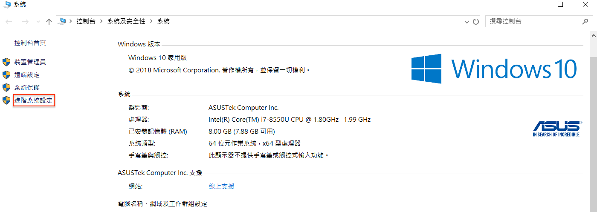
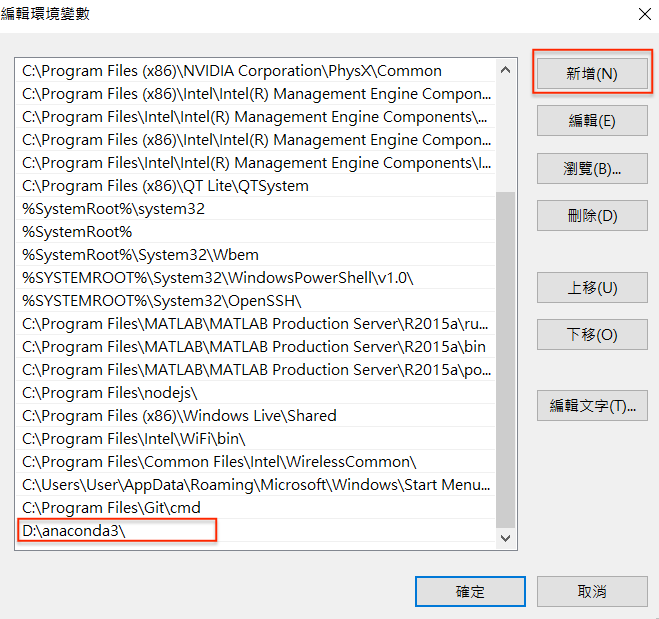

## Anaconda 介紹及安裝
近幾年對於大數據分析研究非常火紅，相對的分析平台相對的重要。在資料分析裡除了用R語言，可以使用 python 作為資料的分析工具，今天就要來介紹 Anaconda ，提供的軟體包管理服務幫你管理所有 Python 套件，此外 Anaconda 中提供 Jupyter Notebook，它的介面簡單並且可以逐行執行 Python 程式並且馬上觀看執行結果，此外在裡面也能撰寫 Markdown 可以一編撰寫程式一邊撰寫流程註解。

## 安裝 Anaconda
進入 [Anaconda]() 官網後選取你的系統，並下載安裝檔。若本身有安裝 Python 的朋友建議先移除原先所安裝的 Python 因為安裝 Anaconda 時會自動另外幫你安裝 Python。因此為了避免衝突還是建議讀者先移除舊有版本。

這邊以 windows10 系統做示範，基本上一直點選下一步選取預設安裝即可。

安裝完成後可以開啟命令提示字元(CMD)或是任一個你習慣的終端機(Terminal)，並輸入 `python` 查看是否有成功安裝好 Python 以及 Anaconda。若有安裝成功則會跟下圖一樣的結果。進入這個畫面後使用者就可以直接在終端機撰寫 Python 程式語言並立即執行成果。

若出現 `python 不是內部或外部命令、可執行的程式或批次檔` 的朋友別緊張，可能只是系統尚未成功設定環境。這時必須手動來新增環境變數。手先開啟本機->右鍵內容->進階系統設定。

接著會跳出系統內容的視窗，找到進階->環境變數。

接著下方的系統變數欄位中尋找 `Path` 並點選編輯 

接著點選新增，再把系統安裝 Anaconda 的資料夾位置貼上即可，通常預設為C碟。

一切就緒後就可以啟動 Anaconda 囉！

