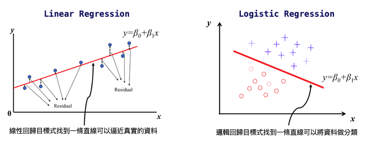
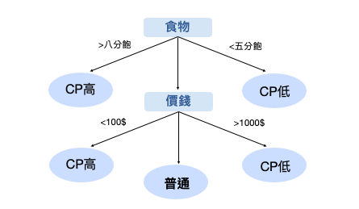

## 機器學習
是一種學習的演算法，是一種從資料中去學習找出解決方法。透過一堆資料有標籤給答案，並從資料集學習與標記間的關聯，最後再從非特定資料去辨認答案。

## 機器學習流程
1. 需求討論
2. 資料擷取
3. 資料清理
4. 資料整合
5. 遺失值處理
6. 特徵工程
7. 模型訓練與評估

## 資料科學(Data Science)
資料科學主要透過機器學習(machine leanring)的技術,讓電腦可以
預測或者推論。


## 從人類學習到機器學習
人類學習: 藉由觀察到的事與物(observations)之經驗來學習(learning)
到特定能力。

機器學習: 藉由收集到的資料(data)來學習到特定功能。

## 機器學習模型
機器學習就是利用歷史資料(Data)找出一個函數

```
f: X -> Y
```

## 什麼是 f
- Decision Tree
- Naive Bayes
- Linear Regression

## 什麼是資料?
一般來說,資料可分成兩個部分:
- 特徵 (Feature):用來描述每一筆資料,通常會用 X 來表示
- 標記 (label):用來表示每一筆資料所對應的輸出,這個輸出樣式可以有
不同的狀態(可能是類別或者實數值等),通常會用 Y 來表示。

Example: 天氣(X:rain,wind,humidity Ｙ:會不會下雨)、影像、信件文字

> 如何擷取好的特徵是在機器學習中很重要的一件事

## 機器如何學習？
- 監督式學習
  - 給許多資料並給答案，透過損失函數計算來找出一個最佳解

- 非監督式學習
  - 給許多資料不給答案，從資料中自己去找出關係，資料與資料間的相似程度與距離(分群演算法)

- 強化式學習
  - 從環境中去學習，給獎賞和逞罰

## 監督式學習
(分類 · 回歸)
- 決策樹 
- 隨機森林
- k-NN 
- 線性回歸 
- 樸素貝葉斯 
- 神經網路 
- 邏輯回歸
- 支援向量機（SVM） 
- 相關向量機（RVM）

## 線性迴歸(Linear Regression)
線性回歸（Linear regression）是統計上在找多個自變數(independent variable)和依變數(dependent variable)之間的關係建出來的模型。只有一個自變數和一個依變數的情形稱為簡單線性回歸(Simple linear regression)，大於一個自變數的情形稱為多元回歸(multiple regression)。

簡單線性回歸: y=β0+β1x
β0：截距(Intercept)，β1：斜率(Slope)為 x變動一個單位y變動的量，如下圖:


所以回歸分析的目標函數/損失函數(loss function)就是希望找到的模型最終的殘差越小越好，來找參數(a和b)。

## 邏輯回歸(Logistic Regression)
線性回歸是用來預測一個連續的值，邏輯回歸是用來分類。使用Sigmoid函數



## K-Nearest Neighbours(KNN)
在k-NN分類中，輸出是一個分類族群。一個物件的分類是由其鄰居的「多數表決」確定的，k個最近鄰居（k為正整數，通常較小）中最常見的分類決定了賦予該物件的類別。若k = 1，則該物件的類別直接由最近的一個節點賦予。

在k-NN回歸中，輸出是該物件的屬性值。該值是其k個最近鄰居的值的平均值。


## 決策樹(Decision Tree)
決策樹是一種常見的機器學習算法，可解決分類和回歸問題。一棵決策樹含有一個根節點，若干個內節點和葉節點，其中葉節點對應的是決策結果，其他節點對應一個屬性測試。這一流程是人們在面臨一個決策問題時很自然的一種處理機制，就是「分而治之」。



## 隨機森林(Random Forest)
隨機森林顧名思義，是用隨機的方式建立一個森林，森林裡面有很多的決策樹組成，隨機森林的每一棵決策樹之間是沒有關聯的。在得到森林之後，當有一個新的輸入樣本進入的時候，就讓森林中的每一棵決策樹分別進行一下判斷，看看這個樣本應該屬於哪一類（對於分類演算法），然後看看哪一類被選擇最多，就預測這個樣本為那一類。

在實務上使用隨機森林的程式很簡單，你所需要關心的參數主要只有n_estimators樹木的多寡(你要創造幾個決策樹來投票)，通常越多越好，但運算時間也會拉長。n_jobs主要是隨機森林支援平行運算，你可以決定要用你電腦的幾個核心去算，來加速運算速度。其他參數新手可以先忽略

隨機森林是這是基於決策樹的集成算法（bagging算法)


## 貝氏分類器(Naive Bayes)
單純貝氏分類其實是基於機率條件的基礎，與KNN計算點跟點之間的距離造成計算量大的缺點、決策樹計算每個feature的entropy或是gini係數不適用數據量較小的情況，單純貝式分類器在這些情況下相對適合。

## 支撐向量機 Support Vector Machine (SVM)
用統計風險最小化的原則來估計一個分類的超平面(hyperplane)，其基礎的概念非常簡單，就是找到一個決策邊界(decision boundary)讓兩類之間的邊界(margins)最大化，使其可以完美區隔開來。

虛線上的點X1,X2 其實就是所謂的支援向量(Support vector)，我們主要是利用支援向量來算出Margin，並最大化Margin。那要怎麼計算margin呢？ 利用高中數學的知識將X1向量-X2向量得到的向量投影到W就可以了！接下來就是在Y*(W*X) ≥k 的條件下(虛線中間沒有點)，來最大化margin 。

低維度空間不可切分的資料拉到高維度空間可以切分了，單層神經網路


